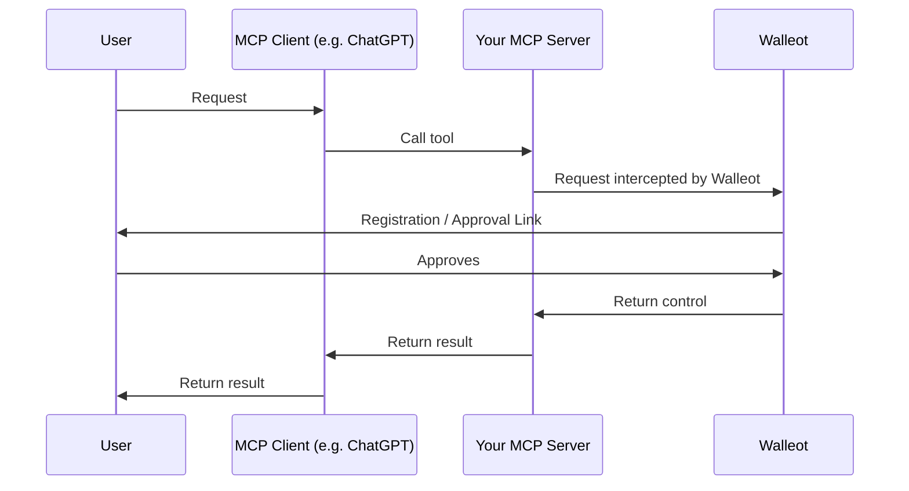

Walleot makes it simple to **accept payments for AI agents and backend tools** with minimal code.
Use it to charge for **per‑use**, **subscriptions** (soon), or **premium features**.

## Why Walleot for developers

- Build revenue into AI capabilities with a few lines of code.
- Micro‑payments without a custom billing stack.
- Auto‑approval thresholds (e.g., ≤ $0.20) reduce friction for small charges (coming soon).
- One‑tap 2FA for larger charges, managed by Walleot (coming soon).
- Sandbox wallets and test keys for fast iteration.

## How it works

- The MCP server receives a request to call your tool. Walleot intercepts this request and generates a payment link.
- For a new user: Walleot handles a simple 2‑click registration via the link.
- For a returning user:
  - Small charges are approved automatically (based on the user’s limits, coming soon).
  - Larger charges trigger a one‑tap approval link sent to the user.
- After approval, the tool runs and returns the result back to the client.



## Hello, Walleot

import Tabs from '@theme/Tabs';
import TabItem from '@theme/TabItem';

<Tabs>
<TabItem value="ts" label="Node.js">

```ts
import { Server } from "@modelcontextprotocol/sdk/server";
import { installWalleot, PaymentFlow } from "walleot";
import { z } from "zod";

const server = new Server({ name: "my-server", version: "0.0.1" });

installWalleot(server, {
  apiKey: "YOUR WALLEOT API KEY"
});

server.registerTool(
  "add",
  {
    title: "Add",
    description: "Add two numbers.",
    inputSchema: { a: z.number(), b: z.number() },
    price: { amount: 0.19, currency: "USD" },
  },
  async ({ a, b }, extra) => {
    return { content: [{ type: "text", text: String(a + b) }] };
  }
);
```

</TabItem>
<TabItem value="py" label="Python">

```python
from mcp.server.fastmcp import FastMCP, Context
from walleot import Walleot, PaymentFlow
import os

mcp = FastMCP("My Server")

walleot = Walleot(
    mcp,
    apiKey=os.getenv("WALLEOT_API_KEY")
)

@walleot.price(0.19, currency="USD")
@mcp.tool()
def add(a: int, b: int, ctx: Context) -> int:
    return a + b
```

</TabItem>
</Tabs>

## What you can build

- Pay‑per‑use APIs (e.g., charge \$0.02 per request).
- Subscription plugins (e.g., \$1/month, soon).
- Premium unlocks (e.g., high‑res image generation).


