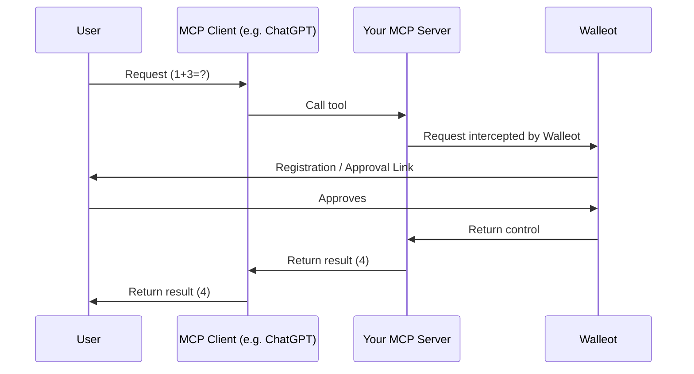

import Tabs from '@theme/Tabs';
import TabItem from '@theme/TabItem';

Get up and running with Walleot in a few minutes.

## Choose your integration

**Building an MCP server?** → Use the SDK examples below for automatic per-call pricing.

**Need direct payment links?** → Use the [REST API examples](/api/reference#complete-payment-flow-example) for manual payment flows.

**Not sure?** → Start with the MCP SDK approach below—it's simpler.

## 1) Get API keys

1. Sign in to your [Walleot dashboard](https://app.walleot.com)
2. Create a new merchant account, or switch to an existing one.
3. Create a **Test** API key.
4. Store it as an environment variable (never commit secrets):

```bash
export WALLEOT_API_KEY="sk_test_..."
```

## 2) Install an SDK

Choose your language:

```bash title="Python"
pip install walleot
```

```bash title="Node"
npm install walleot
# or: pnpm add walleot
```

## 3) Add Walleot to your MCP server

<Tabs>
<TabItem value="ts" label="Node.js">

```ts
import { Server } from "@modelcontextprotocol/sdk/server";
import { installWalleot, Mode } from "walleot";
import { z } from "zod";

const server = new Server({ name: "my-server", version: "0.0.1" });

installWalleot(server, {
  apiKey: process.env.WALLEOT_API_KEY!
});

server.registerTool(
  "add",
  {
    title: "Add",
    description: "Add two numbers.",
    inputSchema: { a: z.number(), b: z.number() },
    price: { amount: 0.19, currency: "USD" }, // $0.19
  },
  async ({ a, b }, extra) => {
    return { content: [{ type: "text", text: String(a + b) }] };
  }
);
```

</TabItem>
<TabItem value="python" label="Python">

```python
from mcp.server.fastmcp import FastMCP, Context
from walleot import Walleot, Mode
import os

mcp = FastMCP("My Server")

walleot = Walleot(
    mcp,
    apiKey=os.getenv("WALLEOT_API_KEY"),
    mode=Mode.ELICITATION
)

@walleot.price(0.19, currency="USD")
@mcp.tool()
def add(a: int, b: int, ctx: Context) -> int:
    return a + b
```

</TabItem>
</Tabs>

## 4) What users experience

- The MCP server receives a request to call your tool. Walleot intercepts this request and generates a payment link.
- For a new user: Walleot handles a simple 2‑click registration via the link.
- For a returning user:
  - Small charges are approved automatically (based on the user’s limits, coming soon).
  - Larger charges trigger a one‑tap approval link sent to the user.
- After approval, the tool runs and returns the result back to the client.



## Next steps

**For MCP servers:**
- [Per‑call pricing](/billing/per-call) - Advanced pricing strategies
- [MCP Integration](/integrations/mcp) - Complete tutorial

**For direct API integration:**
- [API Reference](/api/reference) - Complete payment flows
- [Python SDK](/sdks/python) - Full SDK documentation
- [TypeScript SDK](/sdks/typescript) - Full SDK documentation
